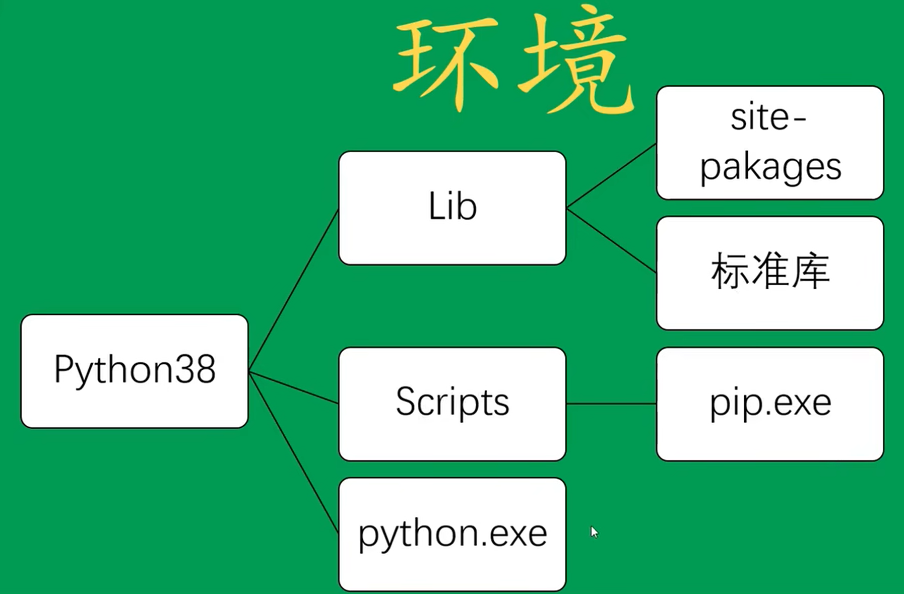

# 模块、包、包的管理

## 模块
- 模块是对代码的进一步封装（类）
- 一个.py文件就是一个模块。
- 模块导入的基本语法
```python
import XXX
import XXX as yy
from XXX import yy as zz
```
- 模块可以分为：
  - 自定义模块 
    - 绝对引用
    - 相对引用
  - 内置模块 math、random、sys、os
  - 第三方模块 
    - Numpy 用于数据科学运算的通用第三方包
    - SciPy 高级科学/数学/工程计算库
    - Pandas (python data analysis) 用于数据分析的第三方包 
    - Matplotlib 用于数据可视化的常用第三方包
    - Scikit-learn 统计机器学习（数据挖掘）库 
    - Pytorch 深度学习（张量运算）库
    - OpenCV, Skimage 图像与视频处理库

## 包
- 包是模块的集合，本质上是一个文件夹

## 包的下载与管理
### 为什么需要Python包管理
- Python 版本问题 
- 如何简易的安装第三方包到本地环境
- 包之间的依赖与冲突问题
### 如何进行Python的包管理
- 下载不同版本的Python
  **原始 Python 的包管理结构**
  

  pip 包管理工具使用方法(Python 3.5 以上版本都自带 pip 工具)：

  - pip install xxx

  - pip install xxx==1.1

  - pip uninstall xxx

  - pip list 显示已安装包

  - 将当前项目的所需包导出成 requirements.txt

    ```python
    pip freeze > requirements.txt 
    ```

    或者

    ```python
    pip install pipreqs
    pipreqs . --encoding=utf8 --force
    ```

  - 将当前项目的所需包全部安装

    ```python
    pip install -r requirements.txt
    ```

    

  - 从特定网站上下载包（国内网络问题）：

    ```python
    pip install  -i https://mirrors.aliyun.com/pypi/simple/    django 	
    ```

  - 国内常用镜像：

    | 提供             | 地址                                      |
    | ---------------- | ----------------------------------------- |
    | 阿里云           | https://mirrors.aliyun.com/pypi/simple/   |
    | 豆瓣             | https://pypi.douban.com/simple/           |
    | 清华大学         | https://pypi.tuna.tsinghua.edu.cn/simple/ |
    | 中国科学技术大学 | http://pypi.mirrors.ustc.edu.cn/simple/   |

- Python 虚拟环境(可选，目前用的不多)

- Anaconda 包管理工具(主流工具)
  Anaconda 下载地址：
  https://www.anaconda.com/
  Anaconda 除了包管理，其中也包含了数据科学常用的开发工具，包括Jupyter Notebook、Spyder等
  将Anaconda下载安装并配置好**环境变量**后，打开CMD、Powershell或者bash shell，将出现以下提示：

- ```
  (base) C:/user/xxxx>conda --version
  conda 4.12.0
  ```

​	conda命令的常用操作：

- 创建新的环境

  ```powershell
  conda create -n your_env_name python=X.X
  ```

- 获取当前系统有多少个环境

  ```
  conda env list
  ```

- 切换到不同环境下

  ```
  conda activate xxxxx
  ```

- 退出某个环境

  ```
  conda deactivate
  ```

- 删除某个环境

  ```
  conda remove --name env_name --all
  ```

- 当前环境下安装某个包

  ```
  pip install xxx
  ```

  ```
  conda install xxx
  ```

- 删除当前环境下的某个包

  ```
  pip uninstall xxx
  ```

  ```
  conda uninstall xxx
  ```

  
